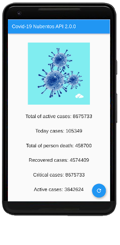
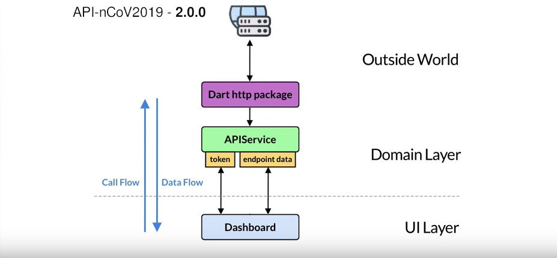

# COVID19_API

A new Dart / Flutter project: REST API client for a Covid-19 API

Ncovapi/2.0.0 is being used to get information about Covid19.

https://apimarket.nubentos.com/store/apis/info?name=API-nCoV2019&version=2.0.0&provider=owner-AT-nubentos.com&tenant=nubentos.com



## Architecture



## Getting Started

This project is based on Flutter's counter app.

Changes to the original counter app

New folders created and associated functionalities populated:
- app/services
- rest_api


## Requirements

- An account with nubentos.com and the setup of Ncovapi/2.0.0
- Flutter and Dart
- Android SDK (Android Studio) and/or Xcode and/or Chrome

Warning: A beta branch needed for Web deployment

Recommended VSC extensions: Dart, Flutter, Error Lens, REST Client

## Useful commands
```bash
$ flutter doctor
$ flutter run -d chrome
```

## Final notes

A few resources to get you started if this is your first Flutter project:

- [Lab: Write your first Flutter app](https://flutter.dev/docs/get-started/codelab)
- [Cookbook: Useful Flutter samples](https://flutter.dev/docs/cookbook)

For help getting started with Flutter, view our
[online documentation](https://flutter.dev/docs), which offers tutorials,
samples, guidance on mobile development, and a full API reference.
